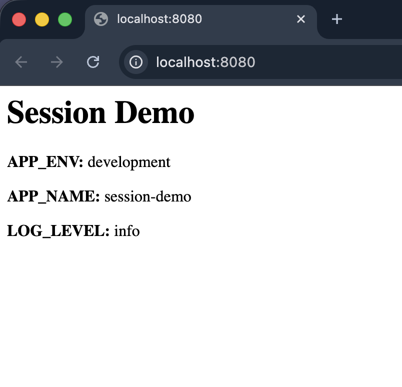

# oyd-exercise-2-1

**Curso:** Optimizaciones y Desempeño — Cloud Deployment Automation
**Sesión 2 — Ejercicio 2.1:** Manifiestos de Kubernetes para una aplicación web Node.js

## Descripción del laboratorio

Containerizar una pequeña aplicación Express en Node.js que lee tres variables de entorno (`APP_ENV`, `APP_NAME`, `LOG_LEVEL`) y las muestra en el navegador, y desplegarla en un cluster local de Kubernetes mediante manifiestos declarativos. El objetivo es ejercitar `Namespace`, `ConfigMap`, `Deployment` y `Service`, junto con la inyección de configuración vía `envFrom`, política de imagen local (`imagePullPolicy: Never`) y exposición interna por `ClusterIP`.

## Resumen de lo realizado

1. Se copiaron los archivos starter (`app.js`, `package.json`, `Dockerfile`) en la raíz del repositorio.
2. Se construyó la imagen Docker `session-demo:1.0` localmente.
3. Se escribieron los 4 manifiestos bajo `k8s/`: `namespace.yaml`, `configmap.yaml`, `deployment.yaml`, `service.yaml`.
4. Se validaron los manifiestos con `kubectl apply --dry-run=client` (sin errores).
5. Se aplicaron al cluster local; los 2 pods quedaron en estado `Running`.
6. Se hizo `kubectl port-forward svc/webapp-svc 8080:8080 -n webapp` y se verificó la respuesta HTTP.
7. Se capturó el screenshot del navegador en `http://localhost:8080` y se guardó como `evidence/k8s-run.png`.


## Validate and apply

```bash
kubectl apply -f k8s/ --dry-run=client
kubectl apply -f k8s/
kubectl get pods -n webapp
```

## Salidas de la terminal (logs)

### Build de la imagen y verificación

```bash
$ docker build -t session-demo:1.0 .
...
naming to docker.io/library/session-demo:1.0 done
unpacking to docker.io/library/session-demo:1.0 done

$ docker images session-demo
IMAGE              ID             DISK USAGE   CONTENT SIZE
session-demo:1.0   2571340fbc02        209MB         51.5MB
```

### Validación con `--dry-run=client` (sale sin errores)

```bash
$ kubectl apply -f k8s/ --dry-run=client
configmap/webapp-config configured (dry run)
deployment.apps/webapp configured (dry run)
namespace/webapp configured (dry run)
service/webapp-svc configured (dry run)
```

### Apply al cluster

```bash
$ kubectl apply -f k8s/
namespace/webapp created
service/webapp-svc created
configmap/webapp-config created
deployment.apps/webapp created
```

### Estado de pods, deployment y service

```bash
$ kubectl get all -n webapp
NAME                          READY   STATUS    RESTARTS   AGE
pod/webapp-84bbfc7586-qjrwn   1/1     Running   0          11m
pod/webapp-84bbfc7586-xrtbg   1/1     Running   0          11m

NAME                 TYPE        CLUSTER-IP     EXTERNAL-IP   PORT(S)    AGE
service/webapp-svc   ClusterIP   10.96.119.54   <none>        8080/TCP   11m

NAME                     READY   UP-TO-DATE   AVAILABLE   AGE
deployment.apps/webapp   2/2     2            2           11m

NAME                                DESIRED   CURRENT   READY   AGE
replicaset.apps/webapp-84bbfc7586   2         2         2       11m
```

### Respuesta HTTP a través del port-forward

```bash
$ kubectl port-forward svc/webapp-svc 8080:8080 -n webapp &
Forwarding from 127.0.0.1:8080 -> 3000
Forwarding from [::1]:8080 -> 3000

$ curl -s http://localhost:8080
    <h1>Session Demo</h1>
    <p><b>APP_ENV:</b> development</p>
    <p><b>APP_NAME:</b> session-demo</p>
    <p><b>LOG_LEVEL:</b> info</p>
```
## Evidence




## Estructura del repositorio

```
oyd-exercise-2-1/
├── app.js
├── package.json
├── Dockerfile
├── README.md
├── evidence/
│   └── k8s-run.png
└── k8s/
    ├── namespace.yaml
    ├── configmap.yaml
    ├── deployment.yaml
    └── service.yaml
```
